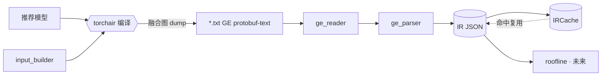

# opseq

从 **PyTorch / TorchRec 推荐模型**抽取**编译器融合后 kernel 级算子序**，归一化为
**后端中立的中间表示（IR）**，供下游做算子**性能上限（roofline）评估**与跨设备对比。

> 一句话：给推荐模型，抓出"融合后到底跑了哪些 kernel、各自输入输出 shape/dtype 是什么"，
> 落成一份可缓存、可复用、跨后端通用的 IR JSON。

## 为什么是它

- **粒度对**：抓的是编译器融合后的 kernel（Ascend torchair/GE 融合图），不是 framework 层算子，
  贴近真实硬件执行，roofline 才有意义。
- **不实跑**：抽取与 roofline 不需要每次跑模型。`extract()` 一次抓图入缓存，相同
  `(model_id, shape_hash, backend)` 直接命中、**零重编译**；实测耗时是独立可选工具。
- **后端中立**：IR 不绑定 Ascend。`Dim = Union[int, str]` 为符号 shape 预留容量，
  Ascend 特有的 `format`（ND / FRACTAL_NZ / NC1HWC0）也在 IR 里有位置；GPU/Inductor 路径
  复用同一 IR。
- **已真机验证**：在 Ascend 910（torch_npu 2.10 / CANN 9.0）上，tiny DLRM 端到端跑通，
  27 个 kernel 级算子、0 Unknown，缓存复用零重编译。

## 架构

详见 **[docs/architecture.md](docs/architecture.md)**（C4 模型 + Mermaid：Context / Container /
Component / Code + 时序图 + 数据流）。数据流概览：



## 安装

```bash
pip install -e .
```

运行环境分两类：

| 场景 | 依赖 | 说明 |
|---|---|---|
| 纯逻辑 / 单测（任意机器） | Python ≥ 3.10 | reader / parser / 归一化 / 缓存均无硬件依赖 |
| Ascend 真机抽取 | `torch` + `torch_npu` + CANN（含 `torchair`） | `torchair` 随 `torch_npu` 内置（`torch_npu.dynamo.torchair`） |
| TorchRec 输入构造 | `torchrec` | 仅 `input_builder` 需要 |

> Ascend 上运行前需 `source /usr/local/Ascend/ascend-toolkit/set_env.sh`。

## 快速开始（Ascend）

> Ascend 上先 `source /usr/local/Ascend/ascend-toolkit/set_env.sh`，可用
> `ASCEND_RT_VISIBLE_DEVICES` 选卡。

### 方式一：配置驱动启动（推荐）

[`examples/run_extract.py`](examples/run_extract.py) 是一个**配置驱动**的启动器，开箱即用：

```bash
# 1) 用内置 tiny_dlrm 默认配置直接跑
python examples/run_extract.py

# 2) 指定配置文件
python examples/run_extract.py --config examples/config.tiny_dlrm.json

# 3) 命令行覆盖 config 字段
python examples/run_extract.py --config examples/config.tiny_dlrm.json \
    --device npu:0 --output /tmp/my.ir.json --no-cache
```

配置文件 [`examples/config.tiny_dlrm.json`](examples/config.tiny_dlrm.json)：

```json
{
  "model": {
    "builtin": "tiny_dlrm",
    "params": { "n_tables": 3, "vocab": 1000, "emb_dim": 16, "dense_dim": 13 }
  },
  "inputs": { "batch_size": 4 },
  "meta": { "model_id": "tiny_dlrm", "model_name": "TinyDLRM", "chip": "Ascend910", "backend": "ascend" },
  "runtime": { "device": "npu", "dump_dir": "/tmp/opseq_dump", "cache_dir": "/tmp/opseq_cache", "output": "tiny_dlrm.ir.json" }
}
```

预期输出（算子序为 Ascend 910 真机实测）：

```text
[opseq] model=tiny_dlrm device=npu backend=ascend ops=27
[opseq] op_type dist: {'Transpose': 3, 'MatMul': 4, 'FusedElementwise': 12, 'Gather': 6, 'Concat': 1, 'Reshape': 1}
 id op_type          in0              -> out0
  0 Transpose        [64, 13]:fp32    -> [13, 64]:fp32[ND]
  1 MatMul           [4, 13]:fp32     -> []:fp32[ND]
  ...
 10 Gather           [3, 4]:int64     -> [4]:int64[ND]
 11 Gather           [1000, 16]:fp32  -> [4, 16]:fp32[ND]
 16 Concat           [4, 16]:fp32     -> [4, 64]:fp32[ND]
  ...
[opseq] IR -> tiny_dlrm.ir.json (~26 KB)
```

> 换成你自己的模型：把 `model.factory` / `inputs.factory` 写成 `"module:callable"`，并显式
> 提供 `input_spec`，模板见 [`examples/config.factory.example.json`](examples/config.factory.example.json)。
> 第二次以相同 `(model_id, shape, backend)` 启动会直接命中缓存、不重编译、不实跑。

### 方式二：库 API 直接调用

```python
import torch, torch_npu  # noqa
from opseq.ascend_extractor import extract
from opseq.cache import IRCache
from opseq.ir import InputSpec, InputDesc

model = MyRecModel().npu().eval()
inputs = {"dense": dense.npu(), "sparse": sparse.npu()}  # 键名需匹配 forward 形参

spec = InputSpec(inputs=[
    InputDesc(name="dense",  shape=[4, 13], dtype="fp32"),
    InputDesc(name="sparse", shape=[3, 4],  dtype="int64"),
])

capture = extract(
    model=model, inputs=inputs,
    model_id="my_rec_v1", model_name="MyRec", chip="Ascend910",
    input_spec=spec, dump_dir="/tmp/opseq_dump",
    cache=IRCache(root="/tmp/opseq_cache"),   # 第二次同 shape 调用直接命中、不重编译
)

for op in capture.ops:
    ins  = ", ".join(f"{t.shape}:{t.dtype}" for t in op.inputs)
    outs = ", ".join(f"{t.shape}:{t.dtype}[{t.format}]" for t in op.outputs)
    print(f"{op.id:>3} {op.op_type:<16} {ins}  ->  {outs}")

open("my_rec.json", "w").write(capture.to_json(indent=2))
```

### TorchRec 输入（可选）

```python
from opseq.input_builder import build_inputs, ShapeConfig, SparseFeatureConfig

inputs = build_inputs(ShapeConfig(
    batch_size=4, dense_dim=13,
    sparse=SparseFeatureConfig(keys=["c1", "c2"], pooling_factors={"c1": 3, "c2": 5}),
    dtype="float16",
))  # -> {"dense": Tensor, "sparse": KeyedJaggedTensor}
```

### 回填实测耗时（可选、独立）

```python
from opseq.profiler_attach import parse_profiler, attach_measured

latencies = parse_profiler("msprof_op_summary.csv")  # {op_name: latency_us}
measured  = attach_measured(capture, latencies)       # 非破坏式，返回新副本
```

## IR 速览

`ModelOpSeqCapture` 是系统契约，下游只依赖它（完整字段见 [架构 L4](docs/architecture.md#l4--code-ir-数据模型)）：

```
ModelOpSeqCapture
├── model_id / model_name / backend / capture_mode / schema_version
├── device_info { chip }
├── input_spec  { inputs[InputDesc], symbol_bindings }
└── ops[ OpNode ]
        ├── id / op_type(归一化) / backend_op_name / fusion_group_id
        ├── inputs[TensorDesc]  / outputs[TensorDesc]   # shape: Dim=int|str, dtype, format, stride
        ├── attrs / source_map
        └── measured?  { latency_us }                   # 仅 profiler 回填后存在
```

## 目录结构

```
src/opseq/
├── ir.py              # IR 数据结构 + JSON 序列化 + validate
├── op_normalizer.py   # GE 算子名 → 归一化 op_type
├── ge_reader.py       # torchair txt(protobuf-text) GE dump → 节点 dict（含 _meta 回退）
├── ge_parser.py       # 节点 dict → ModelOpSeqCapture（纯逻辑）
├── cache.py           # 按 (model_id, shape_hash, backend) 缓存 IR
├── input_builder.py   # specialize 输入（dense + KeyedJaggedTensor）
├── ascend_extractor.py# 抽取编排 + torchair 编译/dump 默认实现
└── profiler_attach.py # 可选：解析 msprof，回填 measured
examples/
├── run_extract.py             # 配置驱动启动器（CLI）
├── config.tiny_dlrm.json      # 内置示例模型配置
└── config.factory.example.json# 自定义模型工厂配置模板
tests/                 # pytest（fixtures 为真机 GE txt dump）
docs/
├── architecture.md    # 本架构说明（C4 + Mermaid）
└── superpowers/        # 设计 spec 与实施 plan
```

## 测试

```bash
pytest -q            # 纯逻辑全量；无 NPU 也可跑（25 passed, 1 skipped）
```

标记（`pyproject.toml`）：`npu`（需 Ascend）、`torch`（需 torch/torchrec）。
`input_builder` 测试在无 `torchrec` 时自动 skip。

## 设计要点

- **硬件解耦**：`extract(..., compile_and_dump=, reader=)` 两个可注入入参，单测里用替身替换
  torchair 与文件解析，核心链路在无 NPU 机器上完整可测。
- **符号 shape 就绪**：当前 `specialize` 存 int；未来切符号 shape 时 `Dim` 直接容纳
  `"s0*256"`，`guards` / `symbol_bindings` 承载约束，数据结构不动。
- **真机已修正**：torchair 只支持 `txt/pbtxt/py`（无 `json`），融合图静态 shape 落在 fx
  `_meta`——reader 已对齐（见 [架构 L3 注记](docs/architecture.md#l3--component组件)）。

## 路线图

- 🔜 融合图 MatMul 输出 shape 推导补全（shape-inference）
- 📋 P3：GPU / TorchInductor 抽取器（消费同一 IR）
- 📋 P4：roofline 评估器 + 跨设备对比

## 文档

- 架构：[docs/architecture.md](docs/architecture.md)
- 设计 spec / 实施 plan：[docs/superpowers/](docs/superpowers/)
