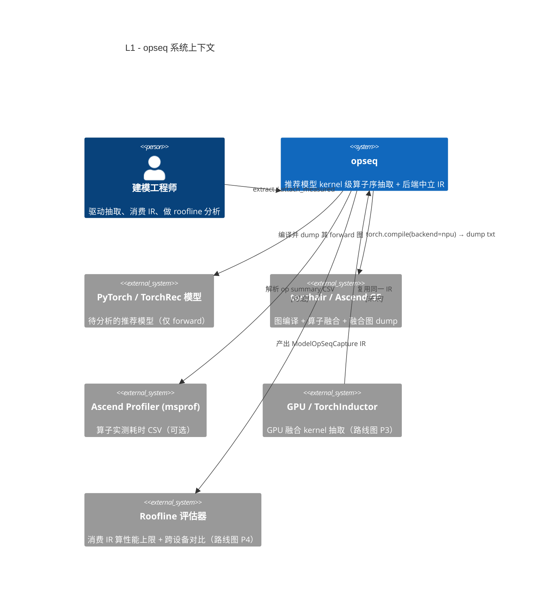
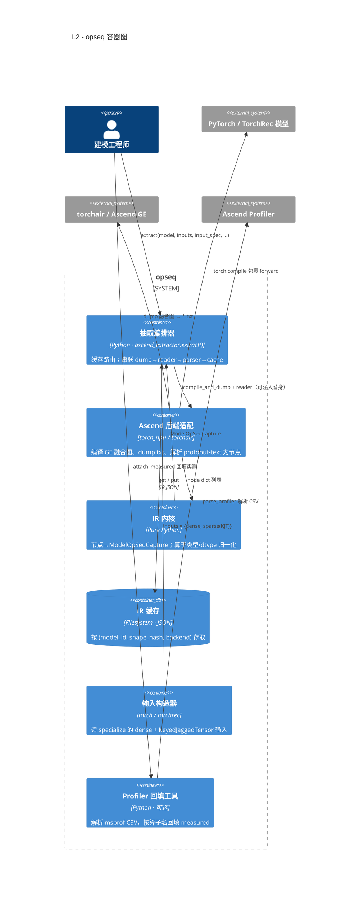
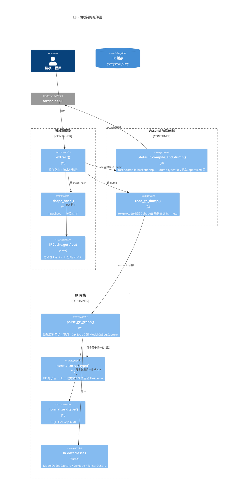
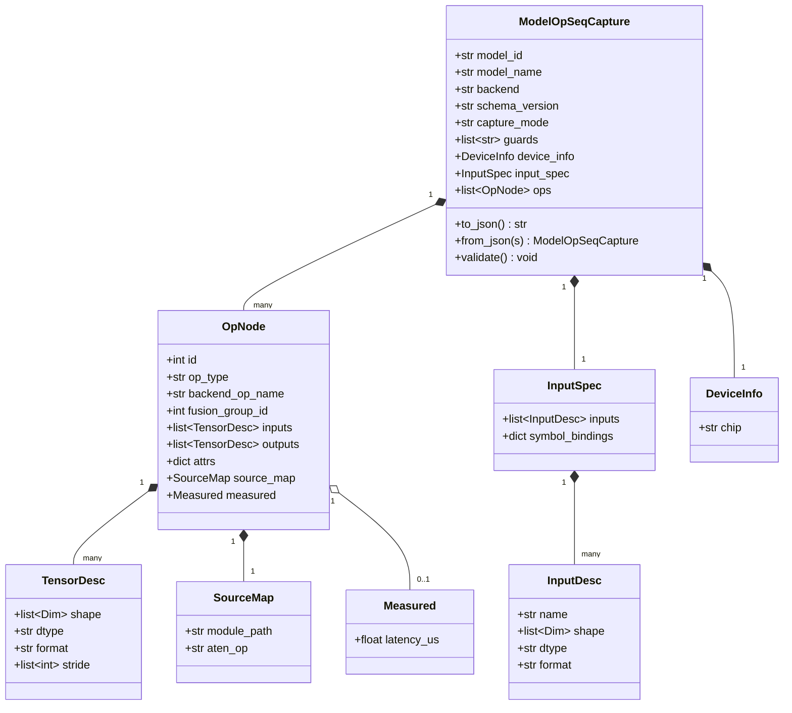
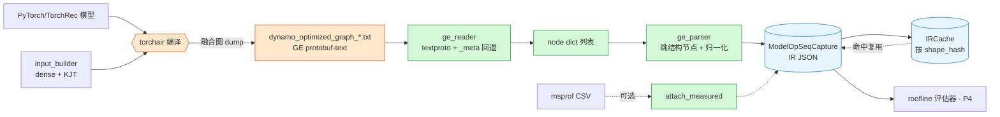

# opseq 架构说明（C4 模型）

> 用途：从 PyTorch / TorchRec 推荐模型抽取 **编译器融合后 kernel 级算子序**，归一化为
> **后端中立的中间表示（IR）**，供下游做算子性能上限（roofline）评估与跨设备对比。
>
> 设计取舍（已在真机验证）：
> - **粒度**：编译器融合后的 kernel（Ascend torchair/GE 融合图；GPU Inductor 为后续）。
> - **范围**：仅推理 forward，不涉及训练/反向。
> - **Shape 策略**：`specialize`（固定代表性 shape）优先；IR 的 shape 字段用
>   `Dim = Union[int, str]` 预留符号维度容量，未来切符号 shape 无需改数据结构。
> - **不实跑**：抽取与 roofline 不需要每次跑模型；`extract()` 一次抓图后进 IR 缓存，
>   相同 `(model_id, shape_hash, backend)` 直接命中，零重编译；profiler 实测耗时是
>   **独立可选**工具，默认不触发。

本文用 [C4 模型](https://c4model.com/) 的 4 个层级（Context → Container → Component → Code）
逐层展开，配合时序图与数据流图。所有图为 [Mermaid](https://mermaid.js.org/)。

---

## L1 · System Context（系统上下文）

opseq 在生态中的位置：谁用它、它依赖谁、产出给谁。



**边界**：opseq 只负责"抽取 + 归一化为 IR"。roofline 计算、跨设备对比、可视化均在系统之外，
通过消费稳定的 IR JSON 解耦。

---

## L2 · Container（容器/子系统）

放大 opseq，内部按职责分为 6 个逻辑子系统。核心原则：**把硬件耦合代码（torchair 编译、
msprof 解析）和纯逻辑（IR、解析、归一化、缓存）隔离开**，用依赖注入在单测里替换硬件部分。



| 容器 | 模块 | 硬件依赖 | 职责 |
|---|---|---|---|
| 抽取编排器 | `ascend_extractor.extract` | 否（逻辑） | 缓存命中判断；编排 dump→reader→parser；写缓存 |
| Ascend 后端适配 | `ascend_extractor._default_compile_and_dump` + `ge_reader` | **是** | torchair 编译 + dump txt；解析 GE protobuf-text 为节点 dict |
| IR 内核 | `ir` + `ge_parser` + `op_normalizer` | 否 | 定义 IR；节点→IR；算子/dtype 归一化 |
| IR 缓存 | `cache` | 否 | `shape_hash` + 文件名安全化 + 防碰撞 key |
| 输入构造器 | `input_builder` | torch/torchrec | 按 `ShapeConfig` 造定形推理输入 |
| Profiler 回填 | `profiler_attach` | 否（消费 CSV） | 非破坏式回填实测耗时 |

---

## L3 · Component（组件）

放大"抽取编排器 + 两个适配层"，展开到函数/类级别，标出真机验证中修正的两处关键点。



> 🔧 真机（Ascend 910 / torch_npu 2.10 / CANN 9.0）验证修正的两处：
> 1. **dump 格式**：torchair `graph_dump.type` 仅支持 `txt/pbtxt/py`（无 `json`）。
>    改用 `txt`（GE GraphDef 的 protobuf-text），并优先取 `optimized`（融合后）图。
> 2. **shape 来源**：融合图里中间张量常缺 `shape{}`，真实静态 shape 落在 torch-fx 注入的
>    `_meta` 串（`Tensor(... shape=torch.Size([4,16]))`）。reader 在 `shape{}` 缺失时回退 `_meta`。

---

## L3' · 抽取时序（含缓存命中/未命中）

```mermaid
sequenceDiagram
    autonumber
    actor Eng as 建模工程师
    participant EX as extract()
    participant CA as IRCache
    participant CD as compile_and_dump
    participant GE as torchair/GE
    participant RD as read_ge_dump
    participant PA as parse_ge_graph

    Eng->>EX: extract(model, inputs, input_spec, ...)
    EX->>EX: h = shape_hash(input_spec)
    EX->>CA: get(model_id, h, backend)
    alt 缓存命中（不实跑、不重编译）
        CA-->>EX: ModelOpSeqCapture
        EX-->>Eng: 直接返回 IR
    else 未命中
        EX->>CD: compile_and_dump(model, inputs, dump_dir)
        CD->>GE: torch.compile(backend=npu); 一次构图 dump
        GE-->>CD: dynamo_optimized_graph_*.txt
        CD-->>EX: dump 路径（优先 optimized）
        EX->>RD: read_ge_dump(path)
        RD-->>EX: node dict 列表（含 _meta 回退 shape）
        EX->>PA: parse_ge_graph(nodes, ...)
        PA-->>EX: ModelOpSeqCapture
        EX->>CA: put(capture, shape_hash=h)
        EX-->>Eng: 返回 IR
    end

    opt 可选 · 独立调用
        Eng->>PA: attach_measured(capture, parse_profiler(csv))
        PA-->>Eng: 回填 measured 的 IR 副本
    end
```

---

## L4 · Code（IR 数据模型）

IR 是整个系统的契约，下游（roofline、GPU 抽取器）只依赖它。`Dim = Union[int, str]` 为
符号 shape 预留容量；Ascend 特有的 `format`（ND/FRACTAL_NZ/NC1HWC0）落在 `TensorDesc`。

> 说明：`backend` 取 `ascend|gpu`；`capture_mode` 当前为 `specialize`；`op_type` 为归一化类型；
> `TensorDesc.shape` 的 `Dim=int|str`（符号就绪），`format` 取 `ND/FRACTAL_NZ/NC1HWC0`；
> `measured` 与 `stride` 为可选（仅在 profiler 回填 / 后端提供时存在）。



---

## 数据流总览



图例：🟧 硬件耦合（仅 Ascend）｜🟩 纯逻辑（可跨平台单测）｜🟦 存储/契约。

---

## 关键设计说明

- **可复用、不重复抓图**：模型 + 一组 shape 只抓一次，结果按 `shape_hash` 进缓存；shape 变了
  换一份 IR，无需重新抓图的同时也无需"动态改算子信息"——直接命中或新抓。
- **硬件解耦**：`extract()` 通过 `compile_and_dump` / `reader` 两个可注入入参，把 torchair
  与文件解析替换为替身，使核心链路（reader→parser→cache）可在无 NPU 的机器上完整单测。
- **符号 shape 就绪**：当前 `capture_mode="specialize"` 存 int；未来切符号 shape 时，
  `Dim` 直接容纳 `"s0*256"` 这类表达式串，`guards` / `InputSpec.symbol_bindings` 承载约束，
  无需重构数据结构。
- **profiler 可选**：`attach_measured` 是非破坏式（deepcopy）旁路，按 `backend_op_name`
  匹配回填 `measured.latency_us`，默认不在抽取链路内触发。

## 路线图

| 编号 | 内容 | 状态 |
|---|---|---|
| P1 | Ascend GE 抽取链路 + IR + 缓存 | ✅ 已完成，真机验证 |
| P2 | profiler 实测耗时回填（可选工具） | ✅ 已完成 |
| — | 融合图 MatMul 输出 shape 推导（shape-inference 补全） | 🔜 增强 |
| P3 | GPU / TorchInductor 抽取器（消费同一 IR） | 📋 独立 spec |
| P4 | roofline 评估器 + 跨设备对比 | 📋 独立 spec |

## 相关文档

- 设计规格：[`docs/superpowers/specs/2026-05-28-ascend-operator-sequence-extraction-design.md`](superpowers/specs/2026-05-28-ascend-operator-sequence-extraction-design.md)
- 实施计划：[`docs/superpowers/plans/2026-05-28-ascend-operator-sequence-extraction.md`](superpowers/plans/2026-05-28-ascend-operator-sequence-extraction.md)
- 项目说明：[`README.md`](../README.md)
